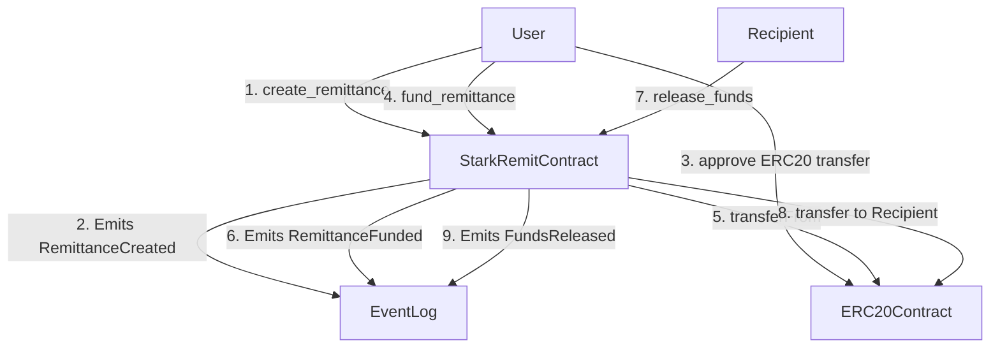

# starkRemit_contract

[](https://opensource.org/licenses/MIT) <!-- Optional: Add relevant badges -->

## Project Overview

**starkRemit_contract** is a Starknet smart contract designed for [**Describe the main purpose of the contract here. e.g., facilitating secure and efficient cross-border remittances, managing escrow services, etc.**].

This project aims to leverage the scalability and low transaction costs of Starknet L2 to [**Explain the problem it solves or the value it provides**].

**Key Features:**
*   [**Feature 1: e.g., User registration and KYC (if applicable)**]
*   [**Feature 2: e.g., Creating remittance requests**]
*   [**Feature 3: e.g., Secure fund locking/escrow**]
*   [**Feature 4: e.g., Fund release upon confirmation**]
*   [**Feature 5: e.g., Dispute resolution mechanism (if applicable)**]
*   [**Feature 6: e.g., Fee structure**]

---

## Setup Instructions

Follow these steps to set up the project locally for development and testing.

**Prerequisites:**
*   [**Prerequisite 1: e.g., Scarb (Cairo package manager)**] - [Link to installation guide]
*   [**Prerequisite 2: e.g., Starknet Foundry (Testing framework)**] - [Link to installation guide]
*   [**Prerequisite 3: e.g., Starknet Devnet (Local testnet)**] - [Link to installation guide]
*   [**Prerequisite 4: e.g., Git**]

**Installation:**

1.  **Clone the repository:**
    ```bash
    git clone <your-repository-url>
    cd starkRemit_contract
    ```
2.  **Install dependencies (if any specific steps are needed beyond Scarb):**
    ```bash
    # e.g., scarb build (often sufficient to fetch dependencies)
    scarb build
    ```
3.  **Configure environment variables (if needed):**
    *   Create a `.env` file based on `.env.example` (if you have one).
    *   Fill in necessary variables like private keys for deployment, RPC endpoints, etc.
    ```bash
    cp .env.example .env
    # Edit .env with your details
    ```

**Running Locally:**

1.  **Start a local Starknet Devnet:**
    ```bash
    # Command to start the devnet
    starknet-devnet &
    ```
2.  **Compile the contract:**
    ```bash
    scarb build
    ```
3.  **Run tests:**
    ```bash
    # Command to run tests (e.g., using Starknet Foundry)
    snforge test
    ```

---

## Available Scripts

This project includes the following scripts to aid development:

*   `scarb build`: Compiles the Cairo contract.
*   `snforge test`: Runs the test suite using Starknet Foundry.
*   `[script_name_1]`: [**Description of what the script does, e.g., Deploy to devnet**]
    ```bash
    # How to run the script
    ./scripts/deploy_devnet.sh
    ```
*   `[script_name_2]`: [**Description of what the script does, e.g., Format code**]
    ```bash
    # How to run the script
    scarb fmt
    ```
*   *Add more scripts as needed.*

---

## Project Structure

```
/home/knights/Desktop/starkRemit_contract
├── Scarb.toml             # Project manifest and dependencies
├── src/                   # Main contract source code
│   └── lib.cairo          # Entry point for the contract
├── tests/                 # Contract tests using Starknet Foundry
│   └── test_contract.cairo # Example test file
├── scripts/               # Helper scripts (deployment, etc.) - Optional
└── README.md              # This file
```
*   **`Scarb.toml`**: Defines project metadata, dependencies, and compilation settings.
*   **`src/`**: Contains the core logic of the smart contract written in Cairo.
*   **`tests/`**: Holds integration and unit tests for the contract.
*   **`scripts/`**: Contains utility scripts for tasks like deployment, interaction, etc. (if applicable).

---

## Coding Conventions

*   **Language:** Cairo 1.x+
*   **Formatting:** Use `scarb fmt` for consistent code style.
*   **Naming:**
    *   Contracts: `PascalCase` (e.g., `StarkRemit`)
    *   Functions: `snake_case` (e.g., `create_remittance`)
    *   Variables: `snake_case` (e.g., `sender_address`)
    *   Structs/Enums: `PascalCase` (e.g., `RemittanceDetails`)
    *   Constants: `UPPER_SNAKE_CASE` (e.g., `MAX_AMOUNT`)
    *   Events: `PascalCase` (e.g., `RemittanceCreated`)
*   **Comments:** Use `//` for single-line comments and `///` for documentation comments (doc comments) that explain functions, structs, etc.
*   **Error Handling:** Utilize `panic` for unrecoverable errors and descriptive `Result<T, E>` or custom error types where appropriate. Use `#[external]` and `#[view]` attributes correctly.
*   **Testing:** Write comprehensive tests covering success cases, edge cases, and failure scenarios. Aim for high test coverage.

---

## Deployment Process

**Prerequisites:**
*   Compiled contract artifacts (`target/dev/your_contract_name.contract_class.json`).
*   A funded Starknet account (on the target network: Goerli Testnet, Sepolia Testnet, Mainnet).
*   RPC endpoint for the target network.
*   Deployment tool (e.g., Starkli, Starknet.js).

**Steps (using Starkli as an example):**

1.  **Declare the Class:**
    ```bash
    starkli declare target/dev/starkRemit_contract_StarkRemit.contract_class.json --network <network_name> --account <account_address_or_path> --private-key <private_key_or_path> --compiler-version <compiler_version> --max-fee <max_fee_in_wei>
    # Note the Class Hash output
    ```
2.  **Deploy the Contract Instance:**
    ```bash
    starkli deploy <class_hash> <constructor_arg_1> <constructor_arg_2> ... --network <network_name> --account <account_address_or_path> --private-key <private_key_or_path> --max-fee <max_fee_in_wei>
    # Note the Contract Address output
    ```

*   Replace `<network_name>` with `goerli-1`, `sepolia-1`, or `mainnet`.
*   Replace `<account_address_or_path>`, `<private_key_or_path>`, `<compiler_version>`, `<max_fee_in_wei>`, `<class_hash>`, and constructor arguments with your specific values.
*   Refer to the Starkli documentation for detailed usage.
*   [**Add any project-specific deployment notes or script references here.**]

---

## Component Library Documentation (Contract Interface)

This section describes the main functions (external entry points) and data structures (structs/enums) exposed by the `starkRemit_contract`.

**Structs:**

*   **`RemittanceDetails`**:
    *   `sender: ContractAddress` - The address initiating the remittance.
    *   `recipient: ContractAddress` - The intended recipient address.
    *   `amount: u256` - The amount of funds being sent.
    *   `token_address: ContractAddress` - The address of the ERC20 token being used.
    *   `status: RemittanceStatus` - The current status of the remittance.
    *   `[Other fields as needed...]`
*   **`[Other Struct Name]`**:
    *   `[Field descriptions...]`

**Enums:**

*   **`RemittanceStatus`**:
    *   `Pending`
    *   `Funded`
    *   `Released`
    *   `Cancelled`
*   **`[Other Enum Name]`**:
    *   `[Variant descriptions...]`

**External Functions (`#[external]`):**

*   **`fn constructor(ref self: ContractState, initial_owner: ContractAddress, ...)`**:
    *   Initializes the contract state upon deployment.
    *   *Parameters:* [Describe parameters]
    *   *Usage Example:* Called automatically during deployment.
*   **`fn create_remittance(ref self: ContractState, recipient: ContractAddress, amount: u256, token_address: ContractAddress)`**:
    *   Allows a user to initiate a new remittance request.
    *   *Parameters:* [Describe parameters]
    *   *Emits:* `RemittanceCreated` event.
    *   *Usage Example:* `starkli invoke <contract_address> create_remittance <recipient> <amount_low> <amount_high> <token_address> ...`
*   **`fn fund_remittance(ref self: ContractState, remittance_id: u64)`**:
    *   Allows the sender (or designated funder) to lock funds for a specific remittance. Requires prior ERC20 approval.
    *   *Parameters:* [Describe parameters]
    *   *Emits:* `RemittanceFunded` event.
    *   *Usage Example:* `starkli invoke <contract_address> fund_remittance <remittance_id> ...`
*   **`fn release_funds(ref self: ContractState, remittance_id: u64)`**:
    *   Allows the recipient (or designated party) to claim the funds.
    *   *Parameters:* [Describe parameters]
    *   *Emits:* `FundsReleased` event.
    *   *Usage Example:* `starkli invoke <contract_address> release_funds <remittance_id> ...`
*   **`[Other External Function]`**:
    *   [Description, Parameters, Emits, Usage Example]

**View Functions (`#[view]`):**

*   **`fn get_remittance_details(self: @ContractState, remittance_id: u64) -> RemittanceDetails`**:
    *   Retrieves the details for a specific remittance.
    *   *Parameters:* [Describe parameters]
    *   *Returns:* `RemittanceDetails` struct.
    *   *Usage Example:* `starkli call <contract_address> get_remittance_details <remittance_id> ...`
*   **`[Other View Function]`**:
    *   [Description, Parameters, Returns, Usage Example]

---

## Contributing Guidelines

We welcome contributions to `starkRemit_contract`! Please follow these guidelines:

1.  **Fork the repository:** Create your own copy of the project.
2.  **Create a feature branch:** `git checkout -b feat/your-feature-name` or `fix/your-bug-fix-name`.
3.  **Make your changes:** Adhere to the Coding Conventions.
4.  **Add tests:** Ensure your changes are well-tested.
5.  **Ensure tests pass:** Run `snforge test`.
6.  **Format your code:** Run `scarb fmt`.
7.  **Commit your changes:** Use clear and descriptive commit messages (e.g., following Conventional Commits).
8.  **Push to your branch:** `git push origin feat/your-feature-name`.
9.  **Open a Pull Request (PR):** Target the `main` (or `develop`) branch of the original repository. Provide a clear description of your changes in the PR.
10. **Code Review:** Wait for maintainers to review your PR. Address any feedback provided.

**Reporting Issues:**
*   Use the GitHub Issues tab to report bugs or suggest features.
*   Provide detailed information, including steps to reproduce (for bugs).

---

## Architecture (Optional)

[**If you create architecture diagrams (e.g., using tools like Mermaid, Excalidraw, or image files), embed them here and provide explanations.**]

**Example using Mermaid:**



**Explanation:**
*   [**Explain the flow depicted in the diagram.**]
*   [**Describe the key components and their interactions.**]

---

## License

This project is licensed under the MIT License - see the LICENSE file for details (if you add one).